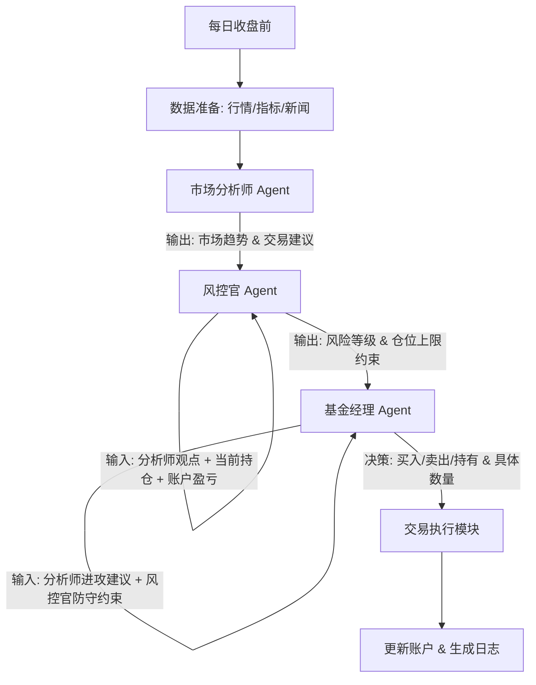

# BreadFree-Simu - A-Share LLM Quantitative Trading Agent

BreadFree-Simu 是一个基于大语言模型（LLM）的 A 股智能量化交易系统。它利用多智能体协作（Multi-Agent）架构，模拟机构投资者的决策流程（分析-风控-决策），旨在探索 AI 在中国特色金融市场（T+1、涨跌停板）中的应用潜力。

## 1. 项目概况 (Project Overview)

本项目不仅仅是一个回测框架，更是一个**AI 投资决策模拟器**。它通过 LangGraph 构建了一个包含“市场分析师”、“风控官”和“基金经理”的智能体团队，每个智能体拥有独立的人设和职责，共同完成交易决策。

*   **核心技术栈**: Python 3.13, LangGraph, OpenAI SDK (接入 DeepSeek/混元), AkShare (数据源), Pyecharts (可视化).
*   **适用标的**: A股宽基 ETF、科技成长股、蓝筹白马股（详见 `breadfree/data/stock_pool.py`）。
*   **当前状态**: 模拟回测阶段（已验证策略逻辑闭环）。

## 2. 核心工作流程 (Core Workflow)

系统按日级别（Daily Bar）运行，采用**全链路串行审核机制**。无论市场分析师的观点如何（即使是“观望”），流程都会继续传递给风控官，因为风控官需要评估现有持仓的风险（例如：市场虽然无机会，但持仓风险过高需要减仓）。



每日决策流程详细说明：

1.  **数据准备 (Data Preparation)**:
    *   通过 `DataFetcher` 获取目标标的的历史行情。
    *   自动预加载（Preload）过去 45 天数据，计算 MA5、MA20、30日波动率等技术指标。
    *   **真实新闻集成**: 通过 `NewsFetcher` 抓取东方财富个股新闻，经过清洗和去重，作为上下文注入到 LLM 中，实现真正的“事件驱动”交易。

2.  **智能体推理 (LangGraph Agents)**:
    *   **市场分析师 (Market Analyst)**: 基于技术面（均线、量能）、政策面（模拟/实时新闻）和情绪面判断市场趋势（上涨/下跌/震荡）。
    *   **风控官 (Risk Manager)**: 基于账户盈亏、持仓比例、市场波动率，结合 A 股 T+1 制度和涨跌停限制，给出仓位约束建议（如“高风险，仓位限制在 30%”）。
    *   **基金经理 (Fund Manager)**: 综合分析师的进攻建议和风控官的防守约束，做出最终决策（BUY/SELL/HOLD 及具体仓位），并输出决策理由。

3.  **交易执行 (Execution Simulation)**:
    *   `BacktestEngine` 模拟撮合交易，计算佣金、印花税，更新账户资金和持仓。
    *   记录每日的决策日志（Reasoning）和资金曲线。

4.  **可视化与复盘 (Visualization)**:
    *   生成交互式 HTML 报表 (`backtest_result.html`)，包含：
        *   **资金曲线 vs 基准策略**: 直观对比 AI 表现。
        *   **买卖点标记**: 在曲线上标注具体的 Buy/Sell 操作。
        *   **回撤分析**: 独立的动态回撤图表。
    *   `logs/llm_debug.log` 详细记录了每个智能体的思考过程，用于策略调优。

## 3. 已完成工作 (Completed Features)

### 基础设施
- [x] **项目脚手架**: 基于 `uv` 的依赖管理，模块化目录结构。
- [x] **数据引擎**: 封装 AkShare 接口，支持 A 股个股、ETF 及黄金现货数据，包含本地缓存机制。
- [x] **回测引擎**: 支持自定义初始资金、手续费率，实现了基于历史数据的事件驱动回测。
- [x] **历史预热**: 解决了回测初期指标计算数据不足的问题（自动回溯 45 天）。

### 策略实现
- [x] **双均线策略 (Baseline)**: 作为基准对照组的传统量化策略。
- [x] **买入持有策略 (Benchmark)**: 用于评估 AI 是否跑赢市场平均水平。
- [x] **LangGraph 多智能体策略**:
    - 实现了 Analyst -> Risk -> Manager 的有向无环图 (DAG) 工作流。
    - **Prompt 优化**: 针对 A 股特性（T+1、政策市）深度定制了 System Prompt。
    - **真实新闻驱动**: 集成 `NewsFetcher`，让 LLM 阅读真实的历史新闻进行决策。

### 工具与生态
- [x] **LLM 客户端**: 统一封装 OpenAI 格式接口，支持腾讯混元、DeepSeek 等模型，集成详细的交互日志。
- [x] **可视化增强**: 集成 Pyecharts，生成包含基准对比、回撤分析和交易标记的专业报表。
- [x] **新闻爬虫**: 基于 `curl_cffi` 的高性能爬虫，支持东方财富新闻抓取与 JSON 缓存。
- [x] **精选标的池**: 整理了适合 LLM 交易的股票列表（`breadfree/data/stock_pool.py`）。

## 4. 待办事项 (Todo List)

**项目定位声明**：本项目专注于**模拟盘（Paper Trading）**与策略研究，旨在验证 AI 在金融决策中的逻辑能力，**不涉及也不鼓励**任何形式的实盘自动交易。

### 阶段一：模拟盘实战化 (Simulation to Paper Trading)
- [ ] **实盘数据接入**: 接入 AkShare 的实时行情接口（Tick/分钟线），替代收盘后的日线数据。
- [ ] **定时任务调度**: 实现 `Scheduler`，在交易日 14:50 自动触发策略运行。
- [ ] **模拟盘信号推送**: 将 LLM 的决策通过消息（如飞书/钉钉/邮件）推送到手机，实现“人机协同”的模拟验证。
### 阶段二：策略深度优化 (Strategy Enhancement)
- [ ] **向量数据库**: 建立历史行情与新闻的向量库，让 LLM 在决策时能参考“历史上相似的一天”。
- [ ] **多周期共振**: 引入周线/月线级别分析，不仅仅局限于日线。
- [ ] **宏观数据集成**: 引入宏观经济指标（如 PMI、社融数据）作为长期趋势判断依据。决策时能参考“历史上相似的一天”。
- [ ] **多周期共振**: 引入周线/月线级别分析，不仅仅局限于日线。

### 阶段三：模拟环境完善 (Simulation Environment Perfection)
- [ ] **模拟撮合优化**: 优化回测引擎的撮合逻辑，更真实地模拟滑点和流动性冲击。
- [ ] **多因子归因分析**: 自动分析 LLM 盈利是来自于择时（Timing）还是选股（Selection）。
- [ ] **Web 仪表盘**: 开发一个简单的 Web 界面，实时展示模拟盘的持仓、盈亏和 LLM 的最新观点。

## 5. 快速开始 (Quick Start)

1.  **配置环境**:
    ```bash
    pip install uv
    uv sync
    source .venv/bin/activate
    ```

2.  **配置 API Key**:
    在环境变量中设置 `HUNYUAN_API_KEY` 或在 `breadfree/utils/llm_client.py` 中修改。

3.  **获取新闻数据**:
    运行爬虫抓取目标标的（默认 300750）的近期新闻，构建事件驱动数据源。
    ```bash
    python breadfree/data/news_fetcher.py
    ```

4.  **运行回测**:
    ```bash
    python main.py
    ```
    *默认回测标的为宁德时代 (300750)，可在 `main.py` 中修改。*

5.  **查看结果**:
    - 终端输出回测摘要。
    - 打开生成的 `backtest_result.html` 查看资金曲线。
    - 查看 `logs/llm_debug.log` 复盘智能体决策逻辑。
