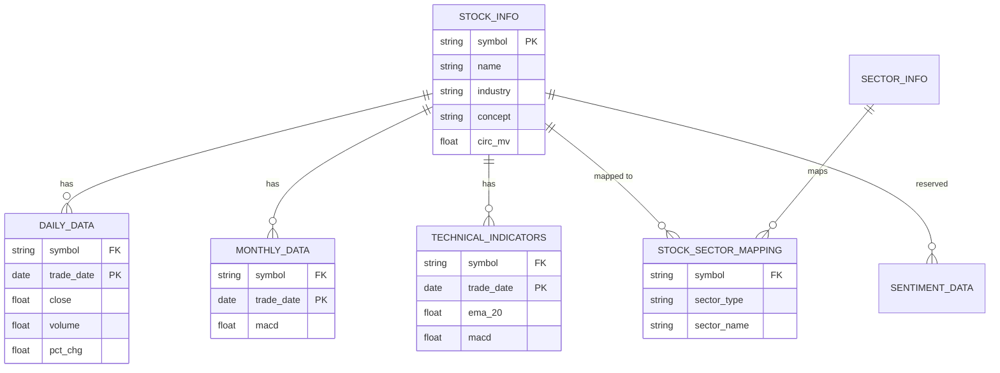

# BreadFree Database Model Documentation

This document describes the SQLAlchemy database schema used for storing stock market data and technical indicators.

## 0. Visual ER Diagram



## 1. Core Data Tables

### 1.1 `StockInfo` (Stock Basic Information)
Stores static metadata for each stock.
- `symbol`: Unique stock code (e.g., '601288').
- `name`: Stock name.
- `market`: Market identifier.
- `industry`: Primary industry sector.
- `concept`: Comma-separated concept sectors.
- `circ_mv`: Circulating market value.

### 1.2 `DailyData` (Daily Price Data)
Stores OHLCV and volume-related metrics.
- `trade_date`: Transaction date (Index).
- `open`, `close`, `high`, `low`: Stock prices.
- `volume`: Trading volume.
- `amount`: Trading turnover amount.
- `amplitude`: Daily price amplitude.
- `pct_chg`: Daily percentage change.
- `turnover`: Turnover rate.

### 1.3 `MonthlyData` (Monthly Aggregated Data)
Resampled from daily data at month-end.
- `trade_date`: End of month date.
- Contains basic OHLCV and monthly technical indicators (`ema_12`, `ema_26`, `macd`).

## 2. Technical & Sentiment Data

### 2.1 `TechnicalIndicators` (Technical Indicators)
Stores pre-computed daily indicators for strategy execution.
- `ema_5/10/20/30/60/120`: Exponential Moving Averages.
- `macd`, `macd_signal`, `macd_histogram`: MACD components.
- `rsi`, `kdj_k/d/j`, `boll_upper/middle/lower`: Other common indicators.

### 2.2 `SentimentData` (Sentiment Analysis)
Placeholder for future news sentiment integration.
- `sentiment_score`: Calculated sentiment score.
- `news_count`: volume of news for that day.
- `keywords`: Key phrases extracted from news.

## 3. Sector Management

### 3.1 `SectorInfo`
Stores definitions of sectors.
- `sector_type`: 'industry' or 'concept'.
- `sector_name`: Unique name within the type.

### 3.2 `StockSectorMapping`
Mapping table for N-to-N relationships between stocks and sectors.
- `symbol`: Reference to `StockInfo`.
- `sector_type`, `sector_name`: Reference to `SectorInfo`.

## 4. Key Constraints
- Most data tables use a `UniqueConstraint` on `('symbol', 'trade_date')` to ensure data integrity and prevent duplicate records during incremental updates.
- Indexed fields: `symbol`, `trade_date`.

## 5. Data Ingestion Workflow

This section describes how to initialize the database and populate it with market data from scratch.

### 5.1 Step 1: Filter Target Stock Symbols
Execute the `get_top150_code.py` script. This script is typically used to filter the top 150 core stocks by market capitalization or a specific target pool.
```bash
python breadfree/data/get_top150_code.py
```

### 5.2 Step 2: Fetch and Sync Market Data
Execute the `data_fetcher.py` script. This script fetches daily/monthly historical data and pre-calculated technical indicators from data sources (e.g., Tushare) and saves them locally.
```bash
python breadfree/data/data_fetcher.py
```

### 5.3 Step 3: Initialize Database Schema
Execute `init_database.py` to create all necessary database tables based on SQLAlchemy models and import the data into the database.
```bash
python init_database.py
```
