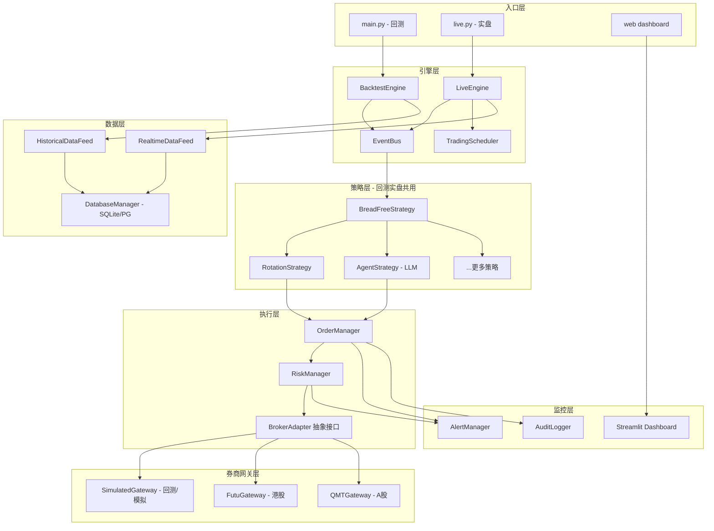

# BreadFree 中低频策略 + 智能决策实盘交易平台技术设计

> 本文档是 BreadFree-Simu 从回测研究平台演进为实盘交易系统的整体技术设计与开发规划。
>
> 券商选型：**富途牛牛 OpenAPI（港股）** + **国金证券 QMT/xtquant（A股）**

---

## 一、现状分析与设计原则

### 当前架构优势（保留）

- 事件驱动的 `on_bar(date, bars)` 策略接口，与 Backtrader 的 `next()` 理念一致
- 策略与执行分离（Strategy / Broker 解耦）
- LLM 多智能体决策（Analyst -> Risk Manager）是核心差异化能力
- 支持多数据源（AkShare / Tushare / curl_cffi）

### 当前架构短板（需补全）

1. **无实盘执行能力** - Broker 是纯内存模拟，无券商网关
2. **无订单生命周期管理** - buy/sell 直接成交，无 pending/partial/rejected 状态
3. **无风控层** - 策略直接操作 Broker，无前置检查
4. **无异步能力** - 全同步执行，无法处理实时推送
5. **回测/实盘不统一** - 没有抽象的 Broker 接口，切换需要改代码
6. **无监控告警** - 无日志审计、无消息推送、无 Web 面板
7. **无调度系统** - 无定时触发、无交易日历感知

### 设计原则（借鉴三大框架）

- **借鉴 vnpy**: Gateway 抽象层设计、事件引擎（EventEngine）、OMS 订单管理
- **借鉴 Backtrader**: 回测/实盘共用同一策略代码（`cerebro.run()` 统一入口）
- **借鉴 nautilus_trader**: 强类型的 Order/Position 模型、异步事件处理

---

## 二、目标架构



---

## 三、核心模块技术设计

### 模块 1: 统一事件总线（EventBus）

借鉴 vnpy 的 `EventEngine`，所有模块通过事件通信，解耦模块间依赖。

**新建文件**: `breadfree/engine/event_bus.py`

核心事件类型:

- `EVENT_BAR` - 新K线到达（回测循环 or 实时推送）
- `EVENT_ORDER` - 订单状态变更（创建/提交/成交/拒绝）
- `EVENT_TRADE` - 成交回报
- `EVENT_POSITION` - 持仓更新
- `EVENT_ACCOUNT` - 账户更新
- `EVENT_RISK` - 风控告警
- `EVENT_LOG` - 日志事件

关键设计:

- 回测模式: 同步分发事件（按时间顺序）
- 实盘模式: 异步分发（asyncio + queue）
- 统一 `Event` 数据类，携带 `event_type` + `data` + `timestamp`

### 模块 2: BrokerAdapter 抽象层（回测/实盘统一接口）

借鉴 Backtrader 的 broker 抽象，使策略代码无需感知是回测还是实盘。

**新建文件**: `breadfree/engine/broker_adapter.py`

```python
class BrokerAdapter(ABC):
    """统一的 Broker 接口 - 回测和实盘共用"""
    @abstractmethod
    def submit_order(self, symbol, direction, quantity,
                     order_type, price=None) -> str: ...
    @abstractmethod
    def cancel_order(self, order_id: str) -> bool: ...
    @abstractmethod
    def get_positions(self) -> Dict[str, Position]: ...
    @abstractmethod
    def get_account(self) -> Account: ...
    @abstractmethod
    def get_equity(self) -> float: ...
```

**改造**: 现有 `broker.py` 改为 `SimulatedBrokerAdapter(BrokerAdapter)`，保持回测兼容。

### 模块 3: 订单管理系统（OMS）

**新建文件**: `breadfree/engine/order_manager.py`

核心数据模型（借鉴 nautilus_trader 的强类型设计）:

- `Order`: order_id, symbol, direction(BUY/SELL), order_type(MARKET/LIMIT), quantity, price, status, filled_qty, avg_fill_price, create_time, update_time
- `OrderStatus`: PENDING -> SUBMITTED -> PARTIAL_FILLED -> FILLED / CANCELLED / REJECTED
- `Trade`: trade_id, order_id, symbol, direction, quantity, price, commission, timestamp

OMS 职责:

- 创建订单（从策略信号）
- 提交订单（经风控检查后发送到 BrokerAdapter）
- 接收回报（更新状态、记录成交）
- 查询（活跃订单、历史订单）
- 通过 EventBus 广播状态变更

### 模块 4: 风控系统（RiskManager）

**新建文件**: `breadfree/engine/risk_manager.py`

风控规则（可配置，通过 config.yaml）:

- 单只标的最大仓位比例（如 30%）
- 单笔订单最大金额
- 日内最大交易次数
- 最大回撤保护（触发后锁仓）
- 标的黑名单/白名单
- A股 T+1 卖出限制检查
- 可用资金充足性检查

执行位置: OMS -> **RiskManager.pre_trade_check()** -> BrokerAdapter

### 模块 5: 富途券商网关（港股）

**新建文件**: `breadfree/gateway/futu_gateway.py`

技术方案:

- 依赖: `futu-api` (v9.6.5608)，需本地运行 FutuOpenD 守护进程
- 行情: `OpenQuoteContext` 订阅实时报价/K线，通过回调推送 `EVENT_BAR`
- 交易: `OpenHKTradeContext` 下单/撤单/查询
- 账户: `accinfo_query()` 查询资金，`position_list_query()` 查询持仓
- 订单回调: 监听订单状态推送，转换为 `EVENT_ORDER` / `EVENT_TRADE`

关键适配:

- 港股支持 T+0，无需额外限制
- 港股手数（lot_size）按标的不同，需从富途接口查询
- 港股交易时段: 9:30-12:00, 13:00-16:00

### 模块 6: 国金 QMT 网关（A股）

**新建文件**: `breadfree/gateway/qmt_gateway.py`

#### QMT/xtquant 架构特点

国金 miniQMT 支持从外部 Python 脚本通过 `xtquant` 库直接调用交易接口（无需在沙箱内运行），与 BreadFree 的架构天然兼容。本地需运行 miniQMT 客户端作为交易中间件。

```
BreadFree (策略决策 + 交易执行)           miniQMT Client (中间件)
┌────────────────────────────┐           ┌─────────────────────┐
│  LiveEngine                 │           │  本地运行            │
│  AgentStrategy              │  xtquant  │  提供交易通道        │
│  RiskManager                │ ────────► │  管理券商连接        │
│  QMTGateway (XtTrader)     │           │  推送行情/回报       │
└────────────────────────────┘           └─────────────────────┘
```

#### 技术方案

- 依赖: `xtquant`（`pip install xtquant`），需本地运行国金 miniQMT 客户端
- 行情: `XtData` 模块，`subscribe_quote()` 订阅实时行情，`download_history_data()` + `get_local_data()` 获取历史数据
- 交易: `XtTrader` 模块，`order_stock()` / `cancel_order_stock()` 下单撤单
- 账户: `query_stock_asset()` 查询资金，`query_stock_positions()` 查询持仓
- 回调: `XtQuantTraderCallback` 处理委托回报（`on_order_callback`）和成交回报（`on_trade_callback`）

#### QMT 核心 API 映射

| BreadFree 操作 | xtquant API | 说明 |
|---|---|---|
| connect | `XtQuantTrader(path, session_id).start().connect()` | 连接 miniQMT |
| submit_order (BUY) | `order_stock(acc, code, xtconstant.STOCK_BUY, qty, xtconstant.FIX_PRICE, price)` | 限价买入 |
| submit_order (SELL) | `order_stock(acc, code, xtconstant.STOCK_SELL, qty, xtconstant.FIX_PRICE, price)` | 限价卖出 |
| cancel_order | `cancel_order_stock(acc, order_id)` | 撤单 |
| get_positions | `query_stock_positions(acc)` | 查询持仓列表 |
| get_account | `query_stock_asset(acc)` | 查询账户资金 |
| subscribe | `XtData.subscribe_quote(codes, period, callback)` | 订阅实时行情 |

#### 关键适配:

- A股 T+1 规则: 当日买入不可卖出，需在 RiskManager 中检查
- A股交易手数固定 100 股（已有 `lot_size` 参数）
- A股交易时段: 9:30-11:30, 13:00-15:00
- miniQMT 需要本地运行客户端作为中间件（路径通常为 `D:\国金证券QMT交易端\userdata_mini`）
- 外部直连模式: xtquant 从外部 Python 进程直接调用，无需沙箱，与 BreadFree 架构完全兼容

### 模块 7: 实盘引擎（LiveEngine）

**新建文件**: `breadfree/engine/live_engine.py`

与 BacktestEngine 对比:

- BacktestEngine: 从历史数据按日期循环调用 `on_bar()`
- LiveEngine: 监听实时行情推送，在合适时机触发 `on_bar()`

核心职责:

- 启动连接: 初始化 Gateway，恢复上次状态
- 行情监听: 接收实时K线，合成为 bar 数据
- 策略调度: 根据策略类型触发（日线策略在收盘前触发，分钟策略每分钟触发）
- 订单跟踪: 监控未完成订单状态
- 优雅关闭: 断线重连 + 状态持久化

### 模块 8: 交易调度器（TradingScheduler）

**新建文件**: `breadfree/engine/scheduler.py`

日程安排:

- **09:15** - 系统启动，连接券商，订阅行情
- **09:25** - 集合竞价结束，获取开盘数据
- **09:30-15:00** - 交易时段，按策略频率触发
- **14:50** - 日线策略触发点（中低频策略的核心时刻）
- **15:05** - 收盘后处理: 持仓快照、日志归档、指标计算
- **21:00** - 夜间任务: 数据更新、报告生成、LLM复盘

交易日历: 集成 A股/港股交易日历，自动跳过节假日

### 模块 9: 策略层改造

**改造文件**: `breadfree/strategies/base_strategy.py`

关键变更:

- `on_bar()` 返回 `List[Signal]` 而非直接调用 broker.buy/sell
- 新增 `Signal` 数据类: symbol, direction, quantity, order_type, price, reason
- 策略不再直接持有 Broker 引用，改为通过 `context` 对象获取账户/持仓信息
- 现有策略（RotationStrategy, AgentStrategy 等）的 broker 调用改为生成 Signal

这样策略层完全不感知是回测还是实盘，由引擎层负责将 Signal 路由到 OMS。

### 模块 10: 数据持久化增强

**改造文件**: `breadfree/data/db_models.py`

新增表:

- `live_orders` - 实盘订单记录
- `live_trades` - 实盘成交记录
- `live_positions` - 每日持仓快照
- `live_accounts` - 每日账户快照
- `strategy_signals` - 策略信号记录（含 LLM 推理过程）
- `risk_events` - 风控事件记录
- `qmt_orders` - QMT 委托记录
- `qmt_executions` - QMT 成交回报

### 模块 11: 监控告警

**新建文件**: `breadfree/monitor/alert_manager.py`

推送渠道:

- 企业微信机器人（Webhook，最简单）
- 钉钉机器人
- 邮件（SMTP）

告警级别:

- CRITICAL: 系统崩溃、连接断开、资金异常 -> 全渠道推送
- WARNING: 订单被拒、风控触发、LLM 调用失败 -> 即时消息
- INFO: 每日交易汇总、策略信号 -> 定时推送

### 模块 12: Web 监控面板

**新建目录**: `breadfree/web/`

技术选型: Streamlit（快速原型）-> 后期可升级为 FastAPI + Vue

核心页面:

- 账户概览: 总权益、可用资金、今日盈亏
- 持仓列表: 当前持仓、成本、浮盈
- 订单流水: 今日订单/成交，支持手动撤单
- 权益曲线: 实盘权益曲线 vs 基准
- 策略日志: LLM 智能体的推理过程（审计复盘）
- 紧急控制: 手动一键清仓、暂停策略

---

## 四、目录结构演进

```
BreadFree-Simu/
├── breadfree/
│   ├── engine/
│   │   ├── backtest_engine.py    # 改造: 使用 BrokerAdapter
│   │   ├── live_engine.py        # 新增
│   │   ├── broker.py             # 改造: 实现 BrokerAdapter
│   │   ├── broker_adapter.py     # 新增: 抽象接口
│   │   ├── order_manager.py      # 新增
│   │   ├── risk_manager.py       # 新增
│   │   ├── event_bus.py          # 新增
│   │   ├── scheduler.py          # 新增
│   │   └── models.py             # 新增: Order/Trade/Signal 等数据模型
│   ├── gateway/                   # 新增
│   │   ├── base_gateway.py       # 网关抽象基类
│   │   ├── futu_gateway.py       # 富途港股
│   │   ├── qmt_gateway.py        # 国金 QMT A股
│   │   └── simulated_gateway.py  # 模拟盘(测试)
│   ├── strategies/                # 改造
│   │   ├── base_strategy.py      # 改造: 返回 Signal
│   │   └── ... (现有策略适配)
│   ├── data/                      # 增强
│   │   ├── realtime_feed.py      # 新增
│   │   ├── db_models.py          # 增强: 新增实盘表
│   │   └── ... (现有保留)
│   ├── monitor/                   # 新增
│   │   ├── alert_manager.py
│   │   └── audit_logger.py
│   ├── web/                       # 新增
│   │   └── dashboard.py
│   └── utils/                     # 现有保留
├── main.py                        # 回测入口 (保留)
├── live.py                        # 新增: 实盘入口
├── config/
│   ├── backtest.yaml              # 从 breadfree/config.yaml 迁移
│   └── live.yaml                  # 新增: 实盘配置
└── tests/                         # 新增
    ├── test_order_manager.py
    ├── test_risk_manager.py
    ├── test_futu_gateway.py
    └── test_qmt_gateway.py
```

---

## 五、开发阶段规划

### Phase 1: 基础设施重构（2-3 周）

重构核心引擎层，建立回测/实盘统一的抽象接口。不改变现有回测行为，但为实盘打好地基。

重点文件:

- `engine/models.py` - Order, Trade, Signal, Account, Position 数据模型
- `engine/event_bus.py` - 事件总线
- `engine/broker_adapter.py` - Broker 抽象接口
- `engine/broker.py` - 现有 Broker 改造为 SimulatedBrokerAdapter
- `engine/order_manager.py` - OMS
- `engine/risk_manager.py` - 风控
- `strategies/base_strategy.py` - 策略接口改造（on_bar 返回 Signal）
- 所有现有策略文件 - 适配新接口

验收标准: 现有回测命令 `uv run python main.py --strategy RotationStrategy` 的输出结果不变。

### Phase 2: 券商网关对接（2-3 周）

实现 Gateway 抽象层和两个券商的具体实现。

重点文件:

- `gateway/base_gateway.py` - Gateway 抽象基类
- `gateway/futu_gateway.py` - 富途港股（futu-api）
- `gateway/qmt_gateway.py` - 国金 A股 QMT（xtquant 外部直连）
- `gateway/simulated_gateway.py` - 模拟网关（用于集成测试）

验收标准: 能通过 SimulatedGateway 跑通完整的 下单->成交->更新持仓 流程。能连接富途查询账户和持仓。能通过 xtquant 连接 miniQMT 查询账户和持仓。

### Phase 3: 实盘引擎（2 周）

构建实盘运行的核心引擎和调度系统。

重点文件:

- `engine/live_engine.py` - 实盘引擎
- `engine/scheduler.py` - 交易调度器
- `data/realtime_feed.py` - 实时行情
- `data/db_models.py` - 新增实盘数据表
- `live.py` - 实盘入口
- `config/live.yaml` - 实盘配置

验收标准: 能在模拟盘环境下，每日 14:50 自动触发策略 -> 生成信号 -> 下单 -> 记录日志。

### Phase 4: 监控运维（1-2 周）

构建监控、告警和 Web 面板。

重点文件:

- `monitor/alert_manager.py` - 企业微信/钉钉推送
- `monitor/audit_logger.py` - 审计日志
- `web/dashboard.py` - Streamlit 监控面板

验收标准: 异常时收到即时通知；通过 Web 面板可查看账户状态和策略日志。

### Phase 5: LLM 智能体实盘适配 + 小资金实盘验证（2 周）

将 LLM 多智能体策略适配到实盘，并进行小资金验证。

重点:

- Agent 策略的 LLM 调用增加超时和降级机制
- LLM 决策结果必须经过 RiskManager 二次验证
- 实时新闻获取集成
- 小资金（1-5万）在模拟盘运行 2 周后转实盘

验收标准: LLM Agent 策略能在实盘环境稳定运行一周无异常。

---

## 六、风险与注意事项

### 资金安全

- 先用模拟盘测试至少 2 周
- 实盘初期使用小资金（1-5万）
- 设置严格的风控上限（最大回撤、单笔金额）

### QMT 运行环境

- miniQMT 客户端需在 Windows 本地运行（作为交易中间件）
- 如果 BreadFree 运行在 Mac/Linux 上，需通过远程桌面或 Windows 虚拟机部署 miniQMT
- xtquant 外部直连模式延迟极低，对中低频策略完全满足

### LLM 决策风险

- LLM 输出不稳定，需要严格的 JSON 解析和校验
- 建议 LLM 只做"建议"，最终决策加入规则层兜底
- LLM 服务不可用时，降级为传统轮动策略

### 合规性

- 确认券商允许程序化交易
- 遵守交易所规则（如 A 股单日交易限制）
- 保留完整审计日志用于合规追溯
